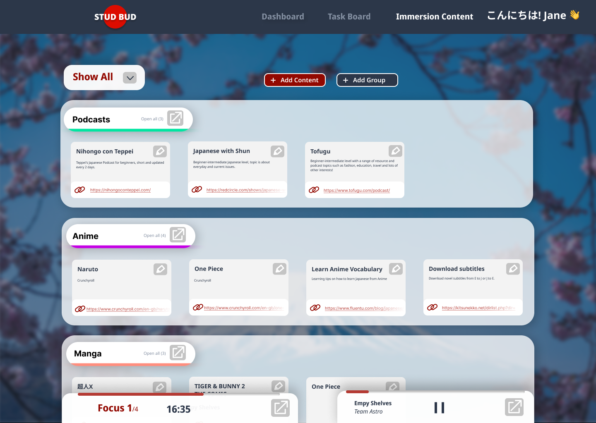
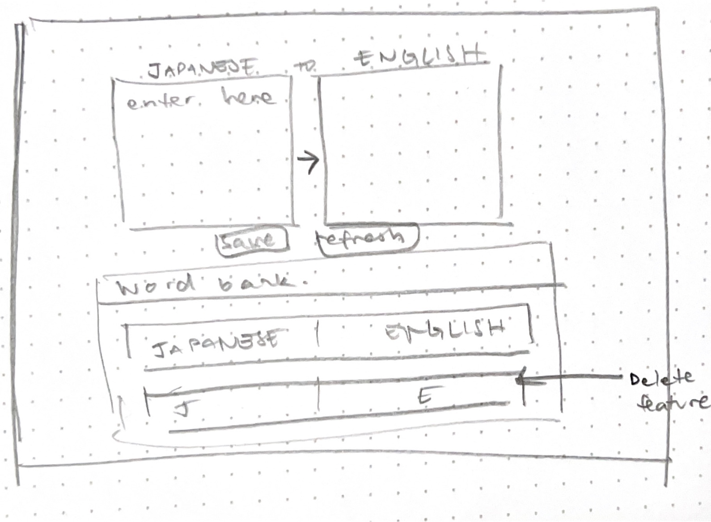
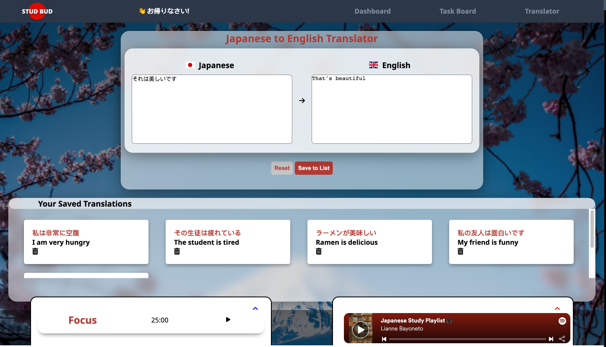
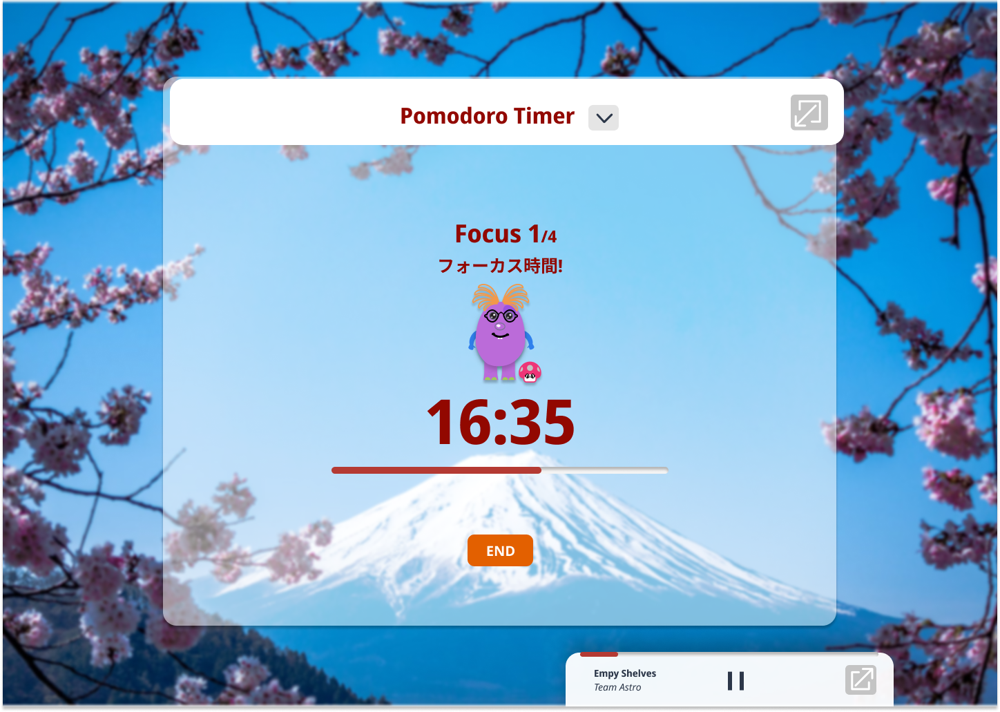
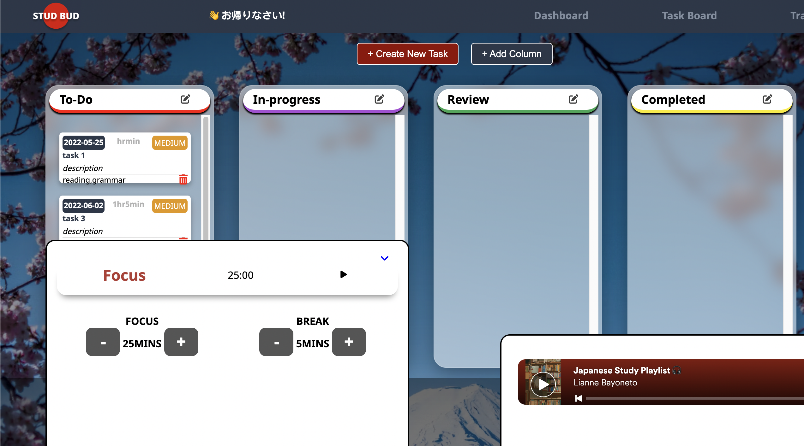
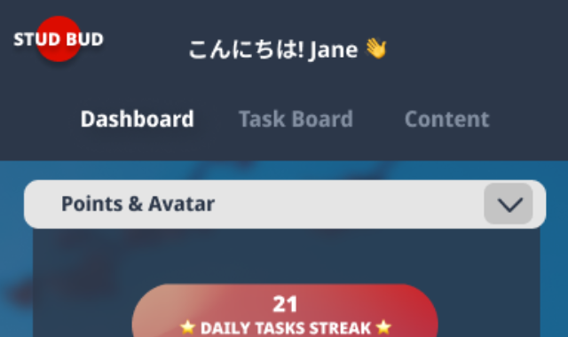
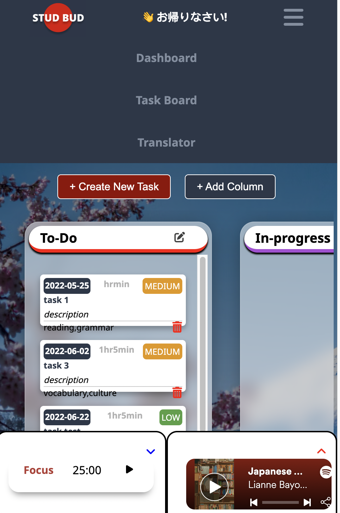

# STUDBUD

## I. Overview
This **STUDBUD** web application prototype aims to help Japanese language learners effecitvely manage their study sessions. Adressing their unique needs and motivations discovered through research, the web app provides the following functioning features: 
  * **Task List**
  * **Kanban Board**
  * **Japanese to English Translator**
  * **Pomodoro Timer**
  * **Music Player**

Overall, in considering the pre-determined development roadmap, the functionality of the website was rated to be of upmost importance but I underestimated how long these features would take. Due to this, only the most essential functioning of the features listed above could be developed. As such, the features are simplified, with the visuals and animations being of lower priority.

## II. Key Iterations
### Immersion Content List ➡ Translator
The biggest change made was omitting the originally design feature of a **immersion content** list creator to a **translator**. As shown below, the prototype was intended to have the following feature:

However, after creating the basic site structure, it was presented to potential users (Previously used at research stage) for feedback and presented the following comments:

* **Preferred use of existing options**
  * "I don't know how much use this list would be just because like I personally don't think its that important to have everything stored together... as an example for me if I want to watch anime I already have a crunchyroll accound and don't need a link to each series im watching" - _Amy (Uni student learning Japanese)_
* **Lacks usefuleness**
  * "If I had to choose what I would use the least, its probably this immersion content feature, like I probably wouldn't actively go on that page because it doesn't really have that much use when im actually studying" - _Alannah (High school student learning Japanese for fun)_

Following this feedback, I considered what other secondary feature options could replace this in accordance to their needs practicality and usefulness and decided on an interpretation of content management through a translator feature. After quickly iterating wireframes for this, the following was created. 

As seen above the translator contains the following key components: 
* Translates Japanese to English in real time through the [Google Translate API's](https://cloud.google.com/translate/)
  
* Users are able to save and store these translations as cards to offer effective revision. Essentially allowing Japanese language learners to use the spaced repeition method to  "learn more in less time" (Gupta, 2016, para.16).

### Pomodoro Timer
Another key iteration was the made to the **functioning** and **visual** of the timer.

* Orginally, as shown in the mockups the timer was intended to be interchangable between a stopwatch and pomdoro timer. However due to user feedback suggesting that it would not be used due to it not contributing to the _"organisation"_ and _"motivation"_ of their study sessions compared to the pomodoro timer, it was removed.

* Reducing the pomodoro timer during development to no longer an exapndable page but a simple pop-up, simplifies the user experience. This also minimises it's potential for further distraction (“Pomodoro Technique,” 2020) of it's larger view.  

### Design for Mobile
In considering the mobile user experience, the navigation design was asessed and iterated to be more user friendly. 

* As seen in the original mockup above, it lacks mobile-friendly interactions with the horizontally oriented navigation as discussed by in _"7 Mobile-Friendly Navigation Best Practices"_ (2020).
  

* To remedy this, the new mobile navigation adopts a hamburger icon and drop-down menu to produce a more intuitive navigation experience.

## III. Challenges
* **Pushing to github**: Due to large file sizes, a new repo had to be made that ignored parcel cache and dist to ensure sucessful pushes. Also, reflecting on how I approached commits and pushes originally of not committing often, made it difficult to push changes made in an organised and structured way. 
* **Sharing JS files**: I intended to use main.js as a way to link HTML easily with JS files, however this caused functioning issues where it failed to connect functioning created on separate JS files. Due to this I had to individually attach each script to the HTML page, which is bad practice. 

## IIII. Future Improvements
* **Persistence**: As it was not necessary at this stage, most features such as tasks being dropped in a particular kanban column, timer countdowns and music playing not continuing its state on refresh is something that could be adressd in the future.
* **Styling**: As styling was of lower priority, focusing on this and implementing animations will enhance the user experience.
* **Timer**: Audio notifications could be added to the pomodoro functioning as a way to expand on the limit of current visual cues.
* **Music**: To offer a more personalised experience, the current spotify based music player could involve a way for users to input their own desired playlists via url. 

## References
7 Mobile-Friendly Navigation Best Practices. (2020, December 23). Bruce Clay, Inc. https://www.bruceclay.com/blog/mobile-friendly-navigation/

100-Projects-HTML-CSS-JavaScript/10—Create Todo App (Drag & Drop) at master · Basir-PD/100-Projects-HTML-CSS-JavaScript. (n.d.). GitHub. Retrieved June 3, 2022, from https://github.com/Basir-PD/100-Projects-HTML-CSS-JavaScript

Bayoneto, L. (n.d.). Japanese study chill. Spotify. Retrieved June 3, 2022, from https://open.spotify.com/playlist/4ZL2KFWRkdJ9FTuxNwUHI6

Build A Notes App in HTML CSS & JavaScript. (n.d.). Retrieved June 3, 2022, from https://www.codingnepalweb.com/build-a-notes-app-in-html-css-javascript/

Cloud Translation. (n.d.). Google Cloud. Retrieved June 3, 2022, from https://cloud.google.com/translate

CodingNepal. (2020, October 15). Responsive Sticky Navigation Bar using HTML CSS & JavaScript. https://www.codingnepalweb.com/responsive-sticky-navigation-bar-html-css/

Gupta, J. (2016, January 23). Spaced repetition: A hack to make your brain store information. The Guardian. https://www.theguardian.com/education/2016/jan/23/spaced-repetition-a-hack-to-make-your-brain-store-information

Icons | Font Awesome. (n.d.). Retrieved June 3, 2022, from https://fontawesome.com

Nar, Z. S. K. (2020). Zisarknar/jp_en_translator [JavaScript]. https://github.com/zisarknar/jp_en_translator (Original work published 2019)

Pomodoro Clock V2—Pure JavaScript| FreeCodeCamp. (n.d.). CodePen. Retrieved June 3, 2022, from https://codepen.io/IAmAlexJohnson/details/XVBrRb

Pomodoro Technique: Ultimate Guide With Examples, Tools, and Tips « Geekbot blog. (2020, October 30). Geekbot Blog. https://geekbot.com/blog/pomodoro-technique-ultimate-guide-with-examples-tools-and-tips/

replit. (n.d.). InteractiveTaskList-Improved. Replit. Retrieved June 3, 2022, from https://replit.com/@robdongas/InteractiveTaskList-Improved?v=1#script.js